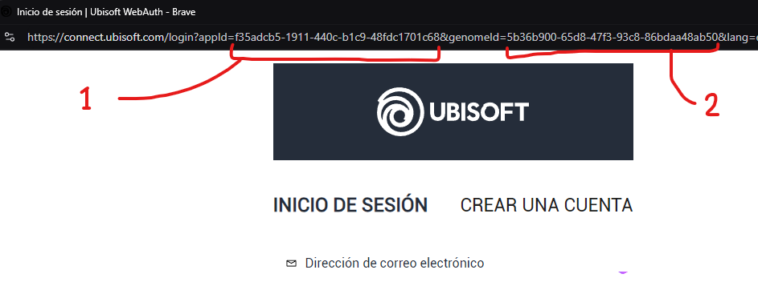
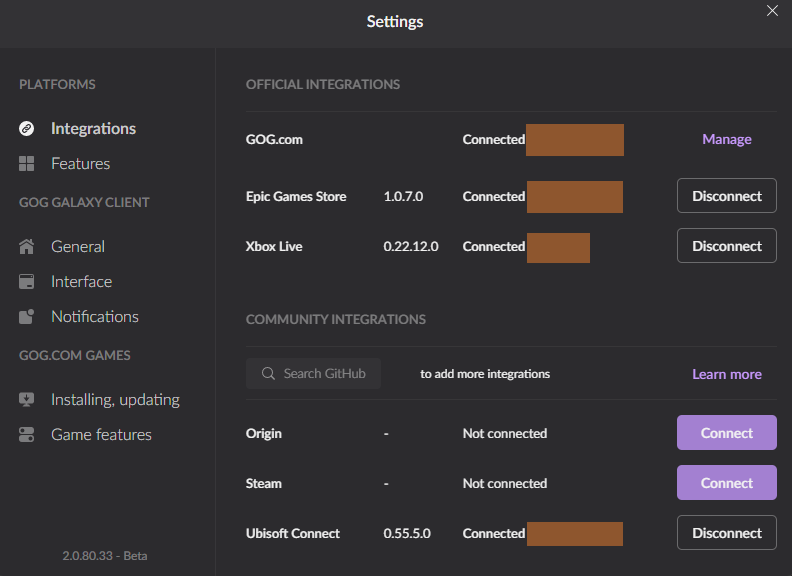

## The issue

Upon connecting the GOG Galaxy client to Ubisoft Connect, it goes into a disconnected state again. This happens just seconds after signing in to the Ubisoft Connect account using the plugin's login. <!-- more -->

## How to fix the issue

???+ note
	This seems to be an open issue in the GitHub repo referenced below. A definitive solution has not been found as this method needs to be re-applied from time to time.

We can use a solution shared on a Reddit post:

> [Not able to connect my ubisoft connect with GoG galaxy](https://www.reddit.com/r/gog/comments/pjsdph/comment/htsh140/?utm_source=share&utm_medium=web3x&utm_name=web3xcss&utm_term=1&utm_content=share_button)  
> by[u/ved7108](https://www.reddit.com/user/ved7108/) in[gog](https://www.reddit.com/r/gog/)

And this is also shared in this GitHub issue:

https://github.com/FriendsOfGalaxy/galaxy-integration-uplay/issues/33#issuecomment-1444362239

The basics are here for reference:

- Click on the "Connect" button in the Ubisoft Connect integration settings on GOG Galaxy
- Upon getting the screen, copy the (1) `appId` and (2) `genomeId` values from the pop-up URL


/// caption
Image showing the necessary values to copy from the login URL
///

- Modify the file `%localappdata%\GOG.com\Galaxy\plugins\installed\uplay_afb5a69c-b2ee-4d58-b916-f4cd75d4999a\consts.py`
	- If using VSCode, you can just execute in a powershell shell this command

``` powershell
code %localappdata%\GOG.com\Galaxy\plugins\installed\uplay_afb5a69c-b2ee-4d58-b916-f4cd75d4999a\consts.py
```

- Find the lines shown below and replace the values with the ones you got from the Ubisoft Connect login screen

```
CLUB_APPID = "f35adcb5-1911-440c-b1c9-48fdc1701c68"
CLUB_GENOME_ID = "5b36b900-65d8-47f3-93c8-86bdaa48ab50"
```

- Save the file and login into the Ubisoft Connect login screen
- It should now stay connected as shown below
!!! info inline end "Remember"
	Remember that this fix, so far, needs to be re-applied if Ubisoft changes the values on their side


/// caption
Image showing a working connection to Ubisoft Connect after a successful file modification
///
