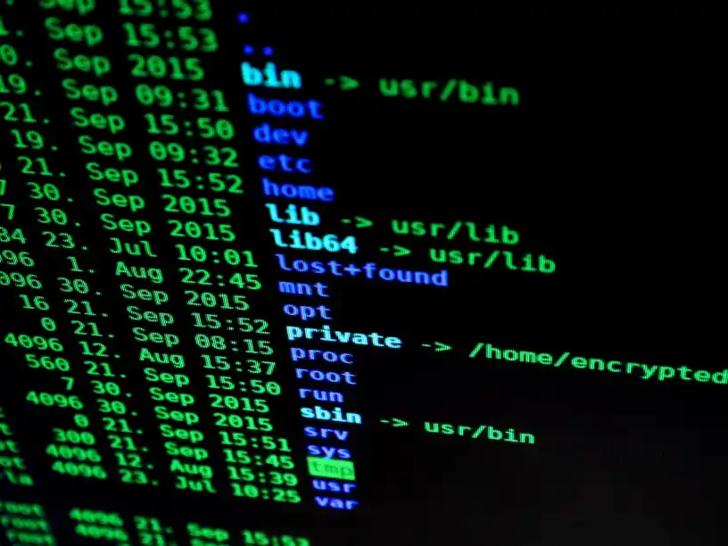
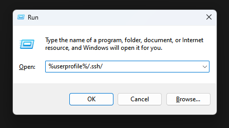

# Set up your SSH key-based authentication from Windows in a single line

<figure markdown>
  { width="400" }
  <figcaption></figcaption>
</figure>

Using Linux directly to interact with Linux servers is pretty great and seamless. But when your daily driver is Windows, this can be a little more cumbersome.

For instance, when connecting with the Windows version of OpenSSH there is a way to copy your generated key for simple password-less logins after that.
<!-- more -->
## Generate your private and public keys in your Windows PowerShell shell

Execute the command below in Windows Terminal or any other terminal in Windows:

``` bash
ssh-keygen
```

This one will generate the necessary keys in your local host. These will be located in your Windows profile directory under the `.ssh/` sub-directory.

You can access it in this location on Windows by using the key combination `Win + R` and then entering this text in the Run window:

``` bash
%userprofile%/.ssh/
```

<figure markdown>
  { width="400" }
  <figcaption>Run window showing the location to the generated ssh keys</figcaption>
</figure>

That directory will include:
- your generated private key `id_rsa`
- your generated public key `id_rsa.pub`

The public key is the one we'll copy into any remote host we want to connect without using a password.

## Now comes the single line I talked about in the title!

Using the command below will make the same process like ssh-copy-id would but working with the OpenSSH in Windows. This will copy your SSH keys into the remote host.

I use the Windows Terminal for this process. Just edit the line with your data. Specifically change the part `user@host.address` with your correct remote user and host IP/hostname.

``` bash
type .ssh\id_rsa.pub | ssh user@host.address "mkdir -p .ssh && cat >> .ssh/authorized_keys"
```

This makes it possible to login directly to your remote host by simply using:

``` bash
ssh user@host
```

Hope this one helps someone out there!