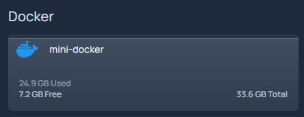

---
tags:
- metrics
- status
- glances
- cron
date: 2025-05-04
title: Install glances and keep it running for showing gethomepage.dev system stats
---

# Install glances and keep it running for showing gethomepage.dev system stats

This guide makes the `glances` application run in the background on every reboot and provide the necessary metrics for homepage.

Install pip:

```bash
sudo apt install python3-pip
```

Install glances with pip for this user:

```bash
pip install --user 'glances[web]'
```

Re-source the `.profile` so the `glances` executable is available in the current environment:

```bash
source ~/.profile
```

Update the crontab to run glances at startup without web UI but able to share system metrics (no web UI to make it more efficient):

``` bash
# this goes in crontab
@reboot /home/ismael/.local/bin/glances -w --disable-webui
```

After a reboot, glances runs automatically on every boot. Works well in an LXC container.

Create the `services.yaml` entry for gethomepage.dev to show server root usage stats:

???+ note
	Several strings in this YAML need customization. See https://gethomepage.dev/widgets/services/glances/ for the specifics on the Glances widget.

```yaml
...
- Docker:
    - mini-docker:
        icon: docker.png
        widgets: 
            - type: glances
              url: http://<IP of server>:61208
              version: 4 # main version of glances used
              metric: fs:/ # showing root usage
...
```

The result should look like this:


